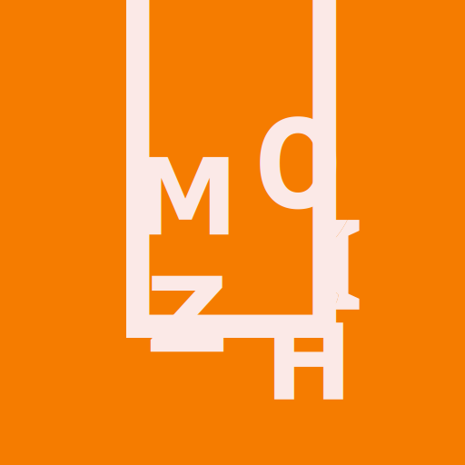

<div align="center">
  
  <h1>Mozhi</h1>

  <a href="https://www.gnu.org/licenses/agpl-3.0.en.html">
    
  </a>
  <a href="https://matrix.to/#/#mozhi:projectsegfau.lt">
  	
  </a>

  <h3>Mozhi (spelt moḻi) is an alternative-frontend for many translation engines.</h3>
</div>

It was initially made as a maintained fork/rewrite of [simplytranslate](https://codeberg.org/SimpleWeb/SimplyTranslate-Web), but has grown to have a lot more features as well!

I'm initially focusing on the api and engines, but eventually Mozhi will have a functioning CLI and webapp.

## Supported Engines:
- Google
- Reverso
- DeepL
- LibreTranslate
- Yandex
- IBM Watson
- MyMemory
- DuckDuckGo (almost 1-1 with Bing Translate)

## Installing
You can either use [docker](https://codeberg.org/aryak/mozhi/src/branch/master/compose.yml) or the build artifacts from [CI jobs on git.projectsegfau.lt](https://git.projectsegfau.lt/arya/mozhi/actions).

## Building
```
go mod download
go run github.com/swaggo/swag/cmd/swag@latest init
go build -o mozhi
```

## API Docs
Mozhi makes use of swagger (using the fiber middleware) to manage the documentation of the API.

You can find it in /api/swagger of any instance ([example](https://mozhi.aryak.me/api/swagger/index.html)).

## Configuration
Features of Mozhi can be customized and toggled on/off using Environment Variables.

- `MOZHI_PORT`: Port the webserver listens on (if hosting API)
- `MOZHI_USER_AGENT`: Change user agent used to make HTTP requests
- `MOZHI_LIBRETRANSLATE_URL`: URL of Libretranslate instance (Example: `MOZHI_LIBRETRANSLATE_URL=https://lt.psf.lt`)

These envvars turn off/on engines. By default all of them are enabled.
- `MOZHI_GOOGLE_ENABLED`
- `MOZHI_REVERSO_ENABLED`
- `MOZHI_DEEPL_ENABLED`
- `MOZHI_LIBRETRANSLATE_ENABLED`
- `MOZHI_YANDEX_ENABLED`
- `MOZHI_WATSON_ENABLED`
- `MOZHI_MYMEMORY_ENABLED`
- `MOZHI_DUCKDUCKGO_ENABLED`

## Instances

| Link | Cloudflare | Country | ISP | 
| -------- | ---------- | ----------- | ----- |
| [mozhi.aryak.me](https://mozhi.aryak.me) | No | India | Airtel |

## Features
- An all mode where the responses of all supported engines will be shown.
- Autodetect which will show the language that was detected
- Text-To-Speech for multiple engines
- A good API (subjective :P)
- All the stuff you expect from a translation utility :)

## Etymology
Mozhi is the word in Tamil for language. Simple as that :P
